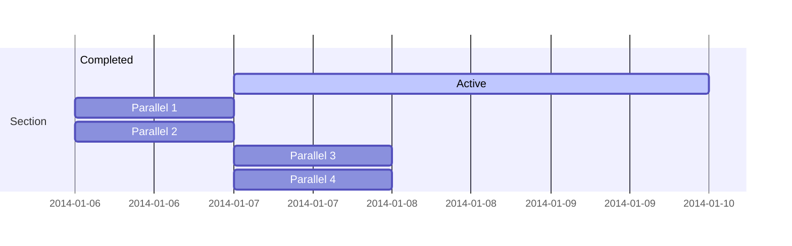

怎麼突然研究memory ordering?
因為我幻想在M1 macbook pro可以用QEMU多核心模擬x86並且在上面操作,結論是可以用但是只能單核心慢到爆炸,開機可能要十分鐘

[UTM模拟器(QEMU for iOS)的二三事](https://zhuanlan.zhihu.com/p/183002799)上面聊到[utm issue](https://github.com/utmapp/UTM/issues/257#issuecomment-612675960)說無法在主機為arm(`weaker memory order`)模擬x86(weaker memory order)時利用`multi-threaded Tiny Code Generator(MTTCG)`所導致無法利用多核心.

所以我們先來探討memory ordering


## MEMORY ORDERING

參考`INTEL手冊 Volume 3 8.2.3.4`

機械碼指令的順序可能為了效能被`編譯器`或是`cpu`(`Dynamic Pipeline Scheduling`)重新排序執行,在單線程的程式沒有執行問題,但是在多核心多線程的程式可能會發生問題這個就是`memory reorder`造成的錯誤


參考[浅谈Memory Reordering](http://dreamrunner.org/blog/2014/06/28/qian-tan-memory-reordering/),[Weak vs. Strong Memory Models](https://preshing.com/20120930/weak-vs-strong-memory-models/)


 
- program ordering(strong ordering))
    Intel386 processor enforces program ordering
- processor ordering




```c
#include <pthread.h>
#include <semaphore.h>
#include <cstdio>
#include <cstdlib>

#define USE_CPU_FENCE  0
#define USE_SINGLE_PROCESSOR 0

#if USE_SINGLE_PROCESSOR
#include <sched.h>
#endif

// Mersenne Twister Parameters
#define MT_N 624
#define MT_M 397

/* A thread-safe random number generator
 */
class MersenneTwister {
 public:
  explicit MersenneTwister(int seed);
  unsigned int Integer();

 private:
  unsigned int buffer_[MT_N];
  int index_;
};

MersenneTwister::MersenneTwister(int seed) {
  buffer_[0] = seed;
  for (index_ = 1; index_ < MT_N; ++index_) {
    buffer_[index_] = (1812433253UL * (buffer_[index_-1]
                                       ^ (buffer_[index_-1] >> 30)) + index_);
  }
}

unsigned int MersenneTwister::Integer() {
  if (index_ >= MT_N) {
    unsigned int i;
    unsigned int x;
    for (i = 0; i < MT_N - MT_M; ++i) {
      x = (buffer_[i] & 0x80000000UL) | (buffer_[i+1] & 0x7fffffffUL);
      buffer_[i] = buffer_[i+MT_M] ^ (x >> 1) ^ ((x & 1) * 0x9908b0dfUL);
    }
    for (; i < MT_N - 1; ++i) {
      x = (buffer_[i] & 0x80000000UL) | (buffer_[i+1] & 0x7fffffffUL);
      buffer_[i] = buffer_[i+MT_M-MT_N] ^ (x >> 1) ^ ((x & 1) * 0x9908b0dfUL);
    }
    x = (buffer_[MT_N-1] & 0x80000000UL) | (buffer_[0] & 0x7fffffffUL);
    buffer_[MT_N-1] = buffer_[MT_M-1] ^ (x >> 1) ^ ((x & 1) * 0x9908b0dfUL);
    index_ = 0;
  }
  unsigned int y = buffer_[index_++];
  y ^= (y >> 11);
  y ^= (y << 7) & 0x9d2c5680UL;
  y ^= (y << 15) & 0xefc60000UL;
  y ^= (y >> 18);
  return y;
}

sem_t begin_sem1;
sem_t begin_sem2;
sem_t end_sem;

int X, Y;
int r1, r2;

void *ThreadFunc1(void *param) {
  MersenneTwister random(1);
  for (;;) {
    sem_wait(&begin_sem1);
    // random delay
    while (random.Integer() % 8 != 0) {
    }
    X = 1;
#if USE_CPU_FENCE
    asm volatile("mfence" ::: "memory");  // prevent CPU ordering
#else
    asm volatile("" ::: "memory");  // prevent compiler ordering
#endif
    r1 = Y;
    sem_post(&end_sem);
  }
  return NULL;
}

void *ThreadFunc2(void *param) {
  MersenneTwister random(2);
  for (;;) {
    sem_wait(&begin_sem2);
    // random delay
    while (random.Integer() % 8 != 0) {
    }
    Y = 1;
#if USE_CPU_FENCE
    asm volatile("mfence" ::: "memory"); // prevent CPU ordering
#else
    asm volatile("" ::: "memory");  // prevent compiler ordering
#endif
    r2 = X;
    sem_post(&end_sem);
  }
  return NULL;
}

int main(int argc, char *argv[]) {
  sem_init(&begin_sem1, 0, 0);
  sem_init(&begin_sem2, 0, 0);
  sem_init(&end_sem, 0, 0);

  pthread_t thread[2];
  pthread_create(&thread[0], NULL, ThreadFunc1, NULL);
  pthread_create(&thread[1], NULL, ThreadFunc2, NULL);

#if USE_SINGLE_PROCESSOR
  cpu_set_t cpus;
  CPU_ZERO(&cpus);
  CPU_SET(0, &cpus);
  pthread_setaffinity_np(thread[0], sizeof(cpu_set_t), &cpus);
  pthread_setaffinity_np(thread[1], sizeof(cpu_set_t), &cpus);
#endif

  int detected = 0;
  for (int i = 1; ; ++i) {
    X = 0;
    Y = 0;
    sem_post(&begin_sem1);
    sem_post(&begin_sem2);
    sem_wait(&end_sem);
    sem_wait(&end_sem);
    if (r1 == 0 && r2 == 0) {
      detected++;
      printf("%d reorders detected after %d iterations\n", detected, i);
    }
  }
  return 0;
}


```

# 參考資源
 