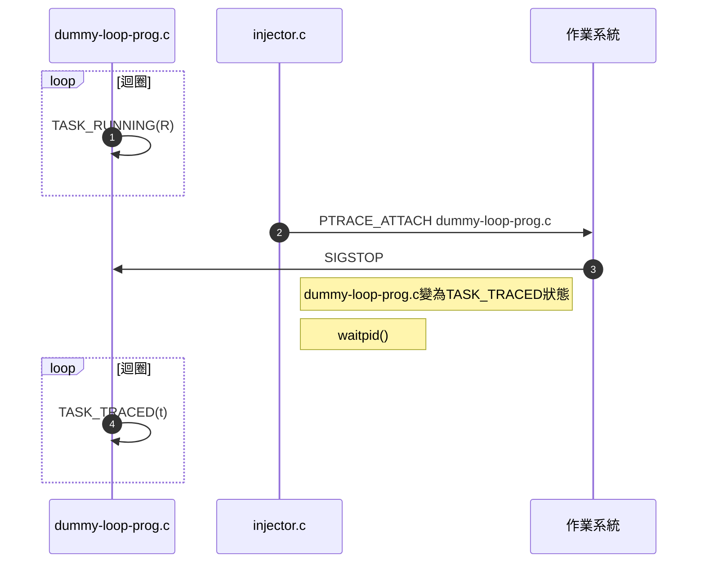

## 介紹


GDB(GNU Debugger)`Richard Stallman`成立`Free Software Foundation`

### debug format

目前linux elf的debug format是`DWARF`所以我們先只探討`DWARF`,
當編譯的時候加`-g`代表就是塞入debug資訊到執行檔

```bash
gcc main.c -g
```

接下來實驗搭配gdb-dashboard套件請先安裝

```bash
wget -P ~ https://git.io/.gdbinit
```

 

## GDB指令

### 啟動GDB

- `gdb --args executablename arg1 arg2 arg3` 打開並且跟蹤程式,如果有參數可以塞入
- `sudo gdb --pid 123` 跟蹤已經執行的程式利用pid,因為跟蹤其他程式所以需要root權限
  
### 進入GDB後

最原始版本gdb可以使用的指令

進入gdb後
- `start` 開始並且中斷在main函數,沒有`symbol table`無法使用
- `starti` 在沒有`symbol table`之下,我們只能從頭看組合語言,所以我們需要`starti`從第一行組合語言開始並且中斷
- `n` 執行下一行原始碼,遇到function call不會中斷,等到function call執行完成才中斷
- `ni` 執行下一行組合語言,遇到function call不會中斷,等到function call執行完成才中斷
- `s` 執行下一行原始碼,遇到function call會進入並且中斷
- `si` 執行下一行組合語言,遇到function call會進入並且中斷
- `b main` 設定中斷在`main`函數(`main`名稱是紀錄在symbol table`readelf -s 執行檔名`),如果gcc設定`-s`代表刪除程式所有`symbol table`,你就無法找到main的位置
- `b *0x123` 設定中斷在`0x123`記憶體位置
- `j *0x123` 跳到`0x123`記憶體位置並且會`馬上`繼續執行
- `c` 持續執行等到下一個中斷`b`出現
- `info b` 列出已經設定哪些中斷
- `d 1` 刪除Num 1的中斷
- `r` 開始執行/重新執行,會一直跑下去直到程式中斷或是結束跑完
- `set disable-randomization off` `這個指令可以gdb隨機載入執行檔到不同記憶體位置`
  - 作業系統因為有ASLR的安全機制會把ELF File Types Dynamic(`ET_DYN`)型態的執行檔(又稱PIC[^pic]或PIE[^pie])載入到隨機的虛擬記憶體位置,但gdb會為了好追蹤偷偷關閉ASLR載入到固定的記憶體位置
- `catch`  
  - `syscall`  
    - `write` `catch syscall write`可以暫停當你呼叫write syscall之後
- `q`離開gdb
- `handle SIGTSTP nostop nopass print` 這裡`SIGTSTP`可以改成你要設定的訊號(`Control+C發送SIGINT`,`Control+Z發送SIGTSTP`),或是`all`全部signal一起設定
  - `stop`/`nostop` 設定收到SIGTSTP訊號gdb要停止嗎？ 
  - `pass`/`nopass` 設定收到SIGTSTP訊號gdb要轉傳給被追蹤的程式嗎？
  - `print`/`noprint` 設定收到SIGTSTP訊號gdb要顯示嗎？
- `info signals` 顯示目前signals的設定
- `python` 在gdb裡面啟動python,用`end`來關閉,目的是可以拿來擴展gdb功能

> [^pie]:position-independent executable 
> [^pic]:position-independent code

#### 原始碼進入點都是main?
[點我下載範例檔案go-elf](../go-elf)

在debug此檔案`go-elf`到底要中斷在哪裡才能進入主程式.

這個範例希望讓大家體會這個`main`名稱只是約定好的,不同程式語言它可能自己定義

提示
```
readelf -s go-elf 
```


main.main 才是go語言編譯出來的 main進入點
```
b main.main
```



#### 有趣的程式

[點我下載x86_64-abi](https://refspecs.linuxfoundation.org/elf/x86_64-abi-0.99.pdf)

- 希望學到簡單c inline assambly
- 希望了解某些暫存器在system v abi的規範下有特殊用途
- 不用main
- 不用prinf libary
- 輸出hello, world!
```c:main.c
void print_asm(char *arg1,long int size){
    __asm__ volatile(
        "mov $1, %%rax\n\t"    //system call 編碼
        "mov $1, %%rdi\n\t"   //arg1:fd 設定1 代表把字串輸入/dev/stdout 這裡就是螢幕輸出地方
        "mov %0,%%rsi\n\t"   //arg2:輸入字串記憶體位置
        "mov %1, %%rdx\n\t" //arg3:這裡輸入字串長度 ,可以跟記憶體位置搭配來輸出到螢幕
        "syscall"//x64 要用此呼叫systemcall 不能在使用int $0x80
        :                      //需要輸出的參數,沒有用到
        :"m" (arg1),"m" (size) //需要輸入的參數,並且紀錄在記憶體就好
    );
}
void _start() {
    char *d="hello, world!\n";
    print_asm(d,14);
    asm("movl $1,%eax;"
        "xorl %ebx,%ebx;"
        "int  $0x80"
    );
}
```
```
gcc -nostdlib main.c
```

#### handle signal範例


- 了解到被追蹤的程式的signal,會被追蹤者掌控

```signal.c
#include <unistd.h>
#include <stdio.h>
#include <sys/types.h>
#include<signal.h>  
void handle_signal(int sig) 
{ 
    printf("我收到SIGNAL拉！！ %d\n", sig); 
} 
int main()
{ 
    printf("pid/tid: %ld\tppid: %ld\n", (long)getpid(), (long)getppid());
    signal(SIGTSTP,handle_signal);
    
    while (1){}
    return 0;
}

```


 

<center>準備環境</center>

1.編譯
 ```bash
gcc signal.c -o signal
```
2.在signal的終端機 執行 signal
```bash
./signal
```
出現pid/tid: 123	ppid: 321
123就是signal程式的pid等等會用到(這裡的數字不會跟我一樣)

3.開啟另一個終端機讓gdb去追蹤signal程式
```bash
sudo gdb --pid 123
```
---

<center>實驗</center>

gdb處理(`handle`)`signal.c`收到`CTRL+Z`(`SIGTSTP`)訊號的時候GDB不停止(`nostop`)不轉傳給`signal.c`(`nopass`)但是要在GDB介面輸出訊息(`print`)


1.在gdb的終端機輸入
```bash
handle SIGTSTP nostop nopass print
```
2.在gdb的終端機輸入`c`讓`signal.c`繼續執行
```bash
c
```

3.在signal的終端機按下CTRL+Z觀察

如果上面`nopass`改成`pass`會有什麼差別？
<center>做給你看拉</center>


 




 
### gdb-dashboard

dashboard後按tab兩下可以看到有哪些指令可以用

"查詢0x123後10bytes的記憶體"
``` 
dashboard memory watch 0x123 10
```


## Debug Python by GDB

剛才的指令我們已經學會如何動態分析編譯語言(`Compiled language`)接下來會教學如何分析直譯語言(`Interpreted language`)我們以python為範例

python有各種直譯器的實作`pypy`(python-JIT),`Jython`(java),`cpython`(C),`IronPython`(c#)

一般人用的python是`cpython`也就是吉多·范羅蘇姆(`Guido van Rossum`)python之父所開發的

接下來的範例只探討利用gdb注入`cpython`
利用查閱(Python/C API Reference Manual)學會如何控制python直譯器([python直譯器教學](https://web.archive.org/web/20201207081711/https://hjlarry.github.io/docs/python/interpreter/)),進而利用gdb注入`python程式`到執行中的`python程序`裏面


### 範例



引用來源[Extending GDB with Python - Lisa Roach](https://www.youtube.com/watch?v=xt9v5t4_zvE&ab_channel=SFPython)
此實驗的架構圖


<center>準備環境</center>

創建main.py並且放入此程式
```python:main.py
import time
import os
print("pid:"+str(os.getpid()))
我的密碼="ggininder"
while True:
    time.sleep(1234)
```
 
---

<center>實驗</center>

1.啟動main.py會看到pid的數值這裡舉例`pid:123`(你的pid會跟我不一樣)
```
python main.py
```

2.開啟另一個終端機輸入下面指令去追蹤`pid:123`程序
```bash
sudo gdb --pid 123
```

告訴python直譯器的GIL要給我用資源
```bash
call (int)PyGILState_Ensure()
```
告訴python直譯器我想執行的程式
```bash
call (int)PyRun_SimpleString("print(globals())")
```
告訴python直譯器的GIL還你資源拉
```bash
call (void)PyGILState_Release(1)
```

觀察看看發生什麼事??




 

## Extending GDB with Python

### 介紹
gdb支持`Python`與`Guile`兩種程式來強化gdb,我想很少人會`Guile`吧??

可以看到有許多gdb的擴展套件他們都是用python寫的
-[pwndbg](https://github.com/pwndbg/pwndbg)
-[peda](https://github.com/longld/peda)
-[gef](https://github.com/hugsy/gef)

下圖可以看到目前大部份強化GDB的工具都是利用python開發所以我們只教python擴展gdb


### 如何載入擴展

- GDB啟動的時候會載入`~/.gdbinit`
- gdb -x 我的套件.py
- 進入gdb打python

 


## GDB原理
 

接下來以x64 linux v5.10作範例

### ptrace




[c語言內嵌入組合語言呼叫systemcall]()->[呼叫syscall到核心的過程]()->`syscall執行的過程`->最後回去你的主程式

 


gdb底層是利用ptrace完成(`strace也是利用ptrade完成`[^strace] )接下來簡單聊一下ptrace systemcall

linux kernel裡面稱被追蹤的程式叫作`tracee`,追蹤人的程式叫`tracer`

點選[ptrace syscall](https://git.kernel.org/pub/scm/linux/kernel/git/torvalds/linux.git/tree/kernel/ptrace.c?h=v5.10#n1236)可以看到ptrace實作的地方,有個叫`SYSCALL_DEFINE4`的macro


  
```
SYSCALL_DEFINE4->經過編譯器前置處理->__x64_sys_ptrace 
```

在x64 linux v5.10的ptrace的名稱
```
__x64_sys_ptrace(long request, long pid, unsigned long addr, unsigned long data)
```


#### PTRACE_ATTACH

跟作業系統報備哪個程式要被追蹤



`ptrace(PTRACE_ATTACH, pid, NULL, NULL)` 細節請看[ptrace.c](https://git.kernel.org/pub/scm/linux/kernel/git/torvalds/linux.git/tree/kernel/ptrace.c?h=v5.10)
  - [確保 tracee 不是kernel thread](https://git.kernel.org/pub/scm/linux/kernel/git/torvalds/linux.git/tree/kernel/ptrace.c?h=v5.10#n378)
    - 不讓你追蹤核心與暫停核心程式,如果真要這樣搞,要用User-mode Linux (UML)參考[jserv教學](https://hackmd.io/@sysprog/user-mode-linux-env)
  - [確保 tracee 與tracer不是相同thread group](https://git.kernel.org/pub/scm/linux/kernel/git/torvalds/linux.git/tree/kernel/ptrace.c?h=v5.10#n380)
    - 因為linux同thread group會共用Signal handlers所以tracer無法處理Signal行為
  - [確保 tracer對tracee有權限](https://git.kernel.org/pub/scm/linux/kernel/git/torvalds/linux.git/tree/kernel/ptrace.c?h=v5.10#n345)
    - [linux security module]()
  - [確保tracee沒有死掉或是變僵屍(EXIT_ZOMBIE/EXIT_DEAD)](https://git.kernel.org/pub/scm/linux/kernel/git/torvalds/linux.git/tree/kernel/ptrace.c?h=v5.10#n400)
    - 都死了還要追蹤？
  - [確保tracee沒有被其他程式追蹤](https://git.kernel.org/pub/scm/linux/kernel/git/torvalds/linux.git/tree/kernel/ptrace.c?h=v5.10#n402)
  - [紀錄tracee已經被追蹤](https://git.kernel.org/pub/scm/linux/kernel/git/torvalds/linux.git/tree/kernel/ptrace.c?h=v5.10#n407)
  - [更改tracer為tracee繼父](https://git.kernel.org/pub/scm/linux/kernel/git/torvalds/linux.git/tree/kernel/ptrace.c?h=v5.10#n409)
  - [發送`SIGSTOP`給tracee](https://git.kernel.org/pub/scm/linux/kernel/git/torvalds/linux.git/tree/kernel/ptrace.c?h=v5.10#n413)
  - 這裡不保證tracee已經暫停-[PTRACE_ATTACH](https://man7.org/linux/man-pages/man2/ptrace.2.html#top_of_page)


 

linux圈子滿亂有[real_parent](https://git.kernel.org/pub/scm/linux/kernel/git/torvalds/linux.git/tree/include/linux/sched.h?h=v5.10#n849)(生父)與[parent](https://git.kernel.org/pub/scm/linux/kernel/git/torvalds/linux.git/tree/include/linux/sched.h?h=v5.10#n852)(繼父)
一開始程式繼父與生父是同一人,但`PTRACE_ATTACH`完後`tracer`會變為`tracee`的繼父,並且當小孩(`tracee`)死掉當然是繼父(`tracer`)被通知(`SIGCHLD`)負責收屍(`wait`),但是如果小孩死掉繼父沒有收屍,小孩就變成僵屍-[sched.h](https://git.kernel.org/pub/scm/linux/kernel/git/torvalds/linux.git/tree/include/linux/sched.h?h=v5.10#n851)

##### 僵屍範例

複製下面dummy-loop-prog.c的程式執行


PTRACE_ATTACH完成後需使用`waitpid()`確保被ptrace追蹤的程式已經停止了
  
以上滿足才能開始ptrace動作,`讀取暫存器`,`讀寫記憶體`,`跳到某行`...

正常駭客要解決
  - W^X policy
    - 目前作業系統都有`W^X policy`所以一塊記憶體只能是寫或是執行不能同時擁有
  - ASLR(Address space layout randomization)
    - gdb會關閉ASLR讓你以為位置固定,但正常程式會啟用並且保護
    - 隨機記憶體位置,駭客就不知道要跳到哪執行某些函數
  
`cat /proc/[pid]/maps`


### breakpoint
??
### 範例程式

[預備知識assambly與systemcall]()

範例PTRACE_ATTACH的過程



#### injector.c


```injector.c
#include <stdio.h>
#include <stdlib.h>
#include <sys/ptrace.h> /* ptrace() */
#include <sys/wait.h>   /* wait() */
 
#include <sys/user.h>   /* struct user_regs_struct */

static char shellcode[] =
    "\x48\xc7\xc0\x3c\x00\x00\x00" //mov $0x3c,%rax
    "\x48\xc7\xc7\x4e\x00\x00\x00" 	//mov $78,%rdi 
    "\x0f\x05";//syscall
// ...->__VA_ARGS__ (VA=variadic)
#define OUT_MSG(x, ...) printf("* " x "\n",## __VA_ARGS__)
#define ERR_MSG(x) printf("\t[Error] " x "\n")

int main(int argc, char *argv[])
{ 
    int pid, offset;
    struct user_regs_struct regs;
    /*確認有沒有輸入pid*/
    OUT_MSG("Injector starts.");
    if (argc < 2) {
        ERR_MSG("PID required in parameter.");
        return -1;
    }
    //把輸入的pid字串轉成int
    pid = atoi(argv[1]);
    OUT_MSG("Attaching process (PID=%d)...", pid);
    //開始PTRACE_ATTACH
    if (ptrace(PTRACE_ATTACH, pid, NULL, NULL) < 0) {
        ERR_MSG("Fail to ptrace process");
        ptrace(PTRACE_DETACH, pid, NULL, NULL);
        return -1;
    }

    OUT_MSG("Process attached.");
    //確保tracee已經停止
    if (waitpid(pid, NULL, WUNTRACED) < 0) {
        ERR_MSG("WUNTRACED");
        exit(1);
    }
    /*拿到tracee的暫存器*/
    OUT_MSG("Getting registers from process.");
    if (ptrace(PTRACE_GETREGS, pid, NULL, &regs) < 0) {
        ERR_MSG("Fail to get registers.");
        ptrace(PTRACE_DETACH, pid, NULL, NULL);
        exit(1);
    }
    /*開始再rip與之後寫入shellcode*/
    OUT_MSG("Injecting shellcode into process...");
    for (offset = 0; offset < sizeof(shellcode); offset++) {
        if (ptrace(PTRACE_POKETEXT, pid,
                   regs.rip + offset,
                   *(int *) &shellcode[offset])) {
            ERR_MSG("Fail to inject.");
            ptrace(PTRACE_DETACH, pid, NULL, NULL);
            exit(1);
        }
    }

    /**/
    OUT_MSG("Detach process (PID=%d).", pid);
    ptrace(PTRACE_DETACH, pid, NULL, NULL);
    OUT_MSG("Done");
    return 0;
}
```


#### dummy-loop-prog.c


  

  這個版本是作最簡單while迴圈程式
```c:dummy-loop-prog.c
#include <unistd.h>
#include <stdio.h>
#include <sys/types.h>
int main()
{ 
    printf("pid/tid: %ld\tppid: %ld\n", (long)getpid(), (long)getppid());
    while (1){}
    return 0;
}
```
  
  
  這個版本利用`PTRACE_TRACEME`讓`tracee`直接被生父追蹤,所以其他程序無法再追蹤他了,來避免被其他程式動態分析
   
```c:dummy-loop-prog_v2.c
#include <unistd.h>//getpid,getppid
#include <stdio.h>//printf
#include <sys/ptrace.h>//ptrace,PTRACE_TRACEME
int main()
{ 
printf("pid/tid: %ld\tppid: %ld\n", (long)getpid(), (long)getppid());
ptrace(PTRACE_TRACEME);
while (1){}
return 0;
}
```
  
  

 

 


#### 編譯

```bash:injector.c
gcc -o injector injector.c -g
```

```bash:dummy-loop-prog.c
gcc -o dummy-loop-prog dummy-loop-prog.c -g 
```
#### 實驗

- 開啟終端機啟動要被注入的程式
```bash
./dummy-loop-prog 
pid/tid: 123	ppid: 321
```
- 開啟新的終端機,這個範例dummy-loop-prog 的`pid`為123
  sudo給injector權限注入`pid`為123的程式
```bash
sudo ./injector 123
```
- 在`dummy-loop-prog`終端機下
```bash
echo $?
78
```
 
這個78是injector注入的
#### 問題？
- 希望把78改成其他數字

### 利用ftrace了解ptrace
[先學學ftrace基礎]()
我們可以利用剛才的程式配合ftrace我們可以感受程式流進去核心後做了什麼事


## DWARF

這裡聊ELF的debug section與GDB如何讀取ELF的DWARF資訊並debug

### debug section壓縮

編譯`main.c`輸出debug資訊(`-g`)在link階段(`-Wl`)放入(`--compress-debug-sections=zlib-gnu`)參數讓debug壓縮
`gcc -Wl,--compress-debug-sections=zlib-gnu -g main.c`

[詳細參考ld](https://man7.org/linux/man-pages/man1/ld.1.html)

- \--compress-debug-sections=
  - zlib
    - 與zlib-gabi一樣
  - zlib-gnu
    - 壓縮DWARF並且更改debug section名稱`.debug_xxx`->`.zdebug_xxx`
  - zlib-gabi
    - 壓縮DWARF並且不會更改debug section名稱
 
 

## 引用
> [trace基本Linux系統呼叫](https://web.archive.org/web/20170307020400/https://ithelp.ithome.com.tw/articles/10186715)
> [jserv-以 ptrace 系統呼叫來追蹤/修改行程](https://web.archive.org/web/20190728011733/http://blog.linux.org.tw/~jserv/archives/002027.html)
> [jserv-ptrace / SIGTRAP / int3 的關聯](https://web.archive.org/web/20161008112707/http://blog.linux.org.tw/~jserv/archives/2010/08/ptrace_sigtrap.html)
> [Infecting Running Processes](https://web.archive.org/web/20200312160301if_/https://0x00sec.org/t/linux-infecting-running-processes/1097)
> [MAKE STACK EXECUTABLE AGAIN](https://web.archive.org/web/20200921055519/https://www.ret2rop.com/2018/08/make-stack-executable-again.html)
> [ptrace() Tutorial](https://web.archive.org/web/20110619141740/http://mikecvet.wordpress.com/2010/08/14/ptrace-tutorial/)
> [Command set-permission(mprotect)](https://web.archive.org/web/20210202181105/https://gef.readthedocs.io/en/latest/commands/set-permission/)
> [strace 是如何工作的](http://arthurchiao.art/blog/how-does-strace-work-zh/)
> [How does strace work](https://blog.packagecloud.io/eng/2016/02/29/how-does-strace-work/)
> [Linux task_struct parent 和 real_parent 的区别](https://blog.csdn.net/JektonLuo/article/details/49736297)
> [How debuggers work: Part 2 - Breakpoints](https://web.archive.org/web/20210225200836/https://eli.thegreenplace.net/2011/01/27/how-debuggers-work-part-2-breakpoints)
> [^strace]:[Intercepting and Emulating Linux System Calls with Ptrace](https://web.archive.org/web/20201207154649/https://nullprogram.com/blog/2018/06/23/)
