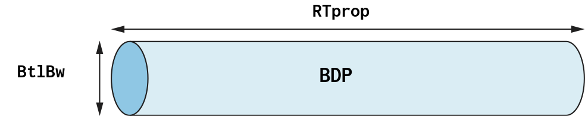
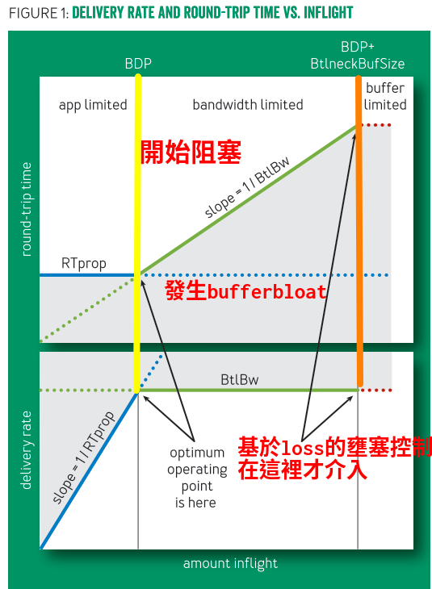

 

## introduction

>作者說物理和氣候研究人員與全球合作者交換petabytes的數據
他們發現使用Gb等級的網路設施在不同洲之間只能提供幾Mb的速度
這些問題始於1980年代創建TCP擁塞控制時所做的設計

>1988年Van Jacobson的壅塞控制的文章說到 封包遺失代表網路開始壅塞了
由於當時技術的限制,所以這這個想法是對的因為當時buffer很小很快塞滿並且開始loss

## 問題-bufferbloat

基於loss的壅塞控制演算法的問題

- 當發生瓶頸的交換機buffer很大時,會一直塞交換機的buffer直到滿出來才介入控制

- 當發生瓶頸交換機buffer較小時，buffer很容易滿出來,交換機就會開始丟棄封包,演算法頻繁減半Contention Window,從而導致吞吐量大量降低

所以需要找到演算法替代基於loss的擁塞控制。

 

## 作者解法

### BDP (bandwidth-delay product)
- RTprop 光速延遲的時間
- BtlBW 可用的頻寬

bdp就是在算,當塞滿鏈路的時候有多少bytes

### 何時開始要控制流量？

 
> — <cite>Leonard Kleinrock [^ee]</cite>告訴我們要在BDP那邊控制會讓個別與整體網路最佳化, 
 
 

[^ee]: The above quote is excerpted from Rob Pike's [talk](https://www.youtube.com/watch?v=PAAkCSZUG1c) during Gopherfest, November 18, 2015.

  
Jeffrey M. Jaffe證明無法求到準確的數值,但是google說我們可以用預測的方式逼近BDP

 

app limited: 只有再這個區域才能探測到真實的RTprop但BtlBW未知,所以可以看到Round trip time固定
bandwidth limites: 只有再這個區域才能探測到真實的BtlBW但RTprop未知,此區域已經塞滿頻寬所以可以看到Delibery rate固定

x軸是總共發出去但還沒收到ack的封包

y軸有兩個部份
- Round trip time:一個封包來回時間
- Delibery rate:每秒到達的封包

下圖的線
- 黃色那條線後代表鏈路已經塞滿開始塞交換機的buffer
- 藍色那條被光速限制
- 綠色那條被最大頻寬所限制
- 紅色那條虛線被交換機buffer所限制
- 中間灰色的部份被藍綠紅線所限制
- 橘色那條線代表鏈路與buffer被佔滿後開始會loss,而基於loss的壅塞控制到現在才開始介入,但此時網路已經有很高的延遲與loss,並且目前記憶體愈來愈便宜,過大的buffer導致bufferbloat可以看到rtt綠色那條線一直升高.


 

## 原始碼v1

### v1問題

- 重傳發生過高

